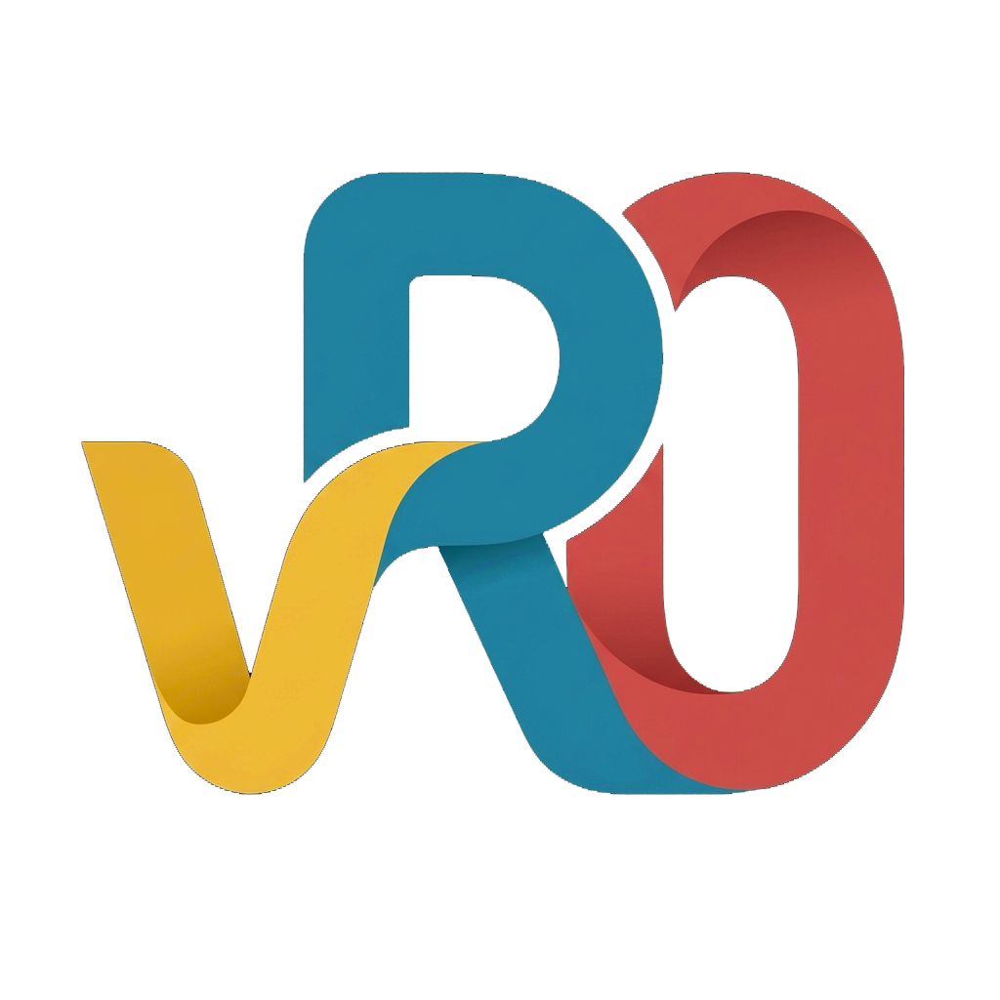

# vibeRacingOverlays

vibecoding easy to run iRacing overlays.

vibeRacingOverlays shows live race information on top of iRacing: standings, relative and a fuel calculator. Each overlay is a widget that you can place, size and style yourself. The app is built to cost as little FPS as possible. It works directly with iRacing, without SimHub or any other program.

## Features

- **Lightweight:** widgets only redraw when something changes, and you set how often each widget may update. When nothing changes, a widget costs nothing.
- **Widgets you arrange yourself:** drag them anywhere on any screen (triple screens work too), resize them with the mouse wheel, and set colors, font size, rows and columns per widget.
- **Single class and multiclass automatically:** the app recognizes the session type and adjusts the standings and relative on its own, with the official iRacing class colors.
- **Layouts:** save complete sets of widgets, for example "Sprint" and "Endurance", and switch between them, even while driving.
- **Presets:** save the settings of a widget and reuse them in every layout.
- **Live preview:** see the effect of each setting immediately, with live iRacing data or a built-in demo race (single class or multiclass). You can set everything up without iRacing running.
- **Reset buttons:** undo a change per setting, per section, or for a whole widget.
- **Dark and light theme** for the app itself.

## Widgets

### Standings
The classification of your session.
- Top of the field plus a window around your own position, so you always see yourself.
- In multiclass sessions: a block per class with class name, class color, fastest lap, strength of field and number of cars. You choose how many rows your own class and the other classes get.
- Columns you can turn on and off and reorder. Every column has a fixed width that fits its content (it follows the font size and the chosen format); only the driver name's width is yours to set. "Column spacing" sets the space between the columns.
  - position and positions gained or lost since the start;
  - car number, driver name, car brand, license and safety rating, iRating;
  - estimated iRating change;
  - gap to the leader, interval to the car ahead, last lap (purple for fastest in class, green for a personal best), best lap;
  - pit status (in the pits, towed, out lap, number of stops), laps in the current stint, laps completed and tire compound.
- Many columns have a format of their own, for example lap times with 3, 2 or 1 decimals, iRating as 4567 or 4.5k, and license as A3.48, A3.4 or only the letter. Numbers always line up neatly in their column.
- Header bar with the items you choose, in your order: session type, class, laps (or an estimate for timed races), time, track and air temperature (°C and/or °F), humidity, strength of field and number of cars, split into a left and a right group.
- **Separate settings for practice & qualifying and for the race:** rows, columns, header and formats can differ per session type (for example 3 decimals and best laps in qualifying, gaps with 1 decimal in the race). The widget switches automatically; colors and size are shared.

### Relative
The cars directly around you on track, with the time difference to each.
- You choose the number of cars ahead and behind.
- Columns that are also in the standings (driver name, license, iRating, last lap) have the same formats there.
- Header bar with the items you choose: laps, time, track and air temperature, humidity, the clock (real or sim time) and your incidents with the limits of the event (for example 5x/17x/25x: next penalty and disqualification).
- Colors show whether a car is a lap ahead of you or a lap down.
- In multiclass sessions, class color bars and car numbers in the class color.
- Pit and tow status per car.
- Cars in the pits are shown in grey, so you see at a glance who isn't racing you. With **Cars in the pits: Dim row** the whole row fades (car number, license and class color too); only the PIT badge stays bright.
- Optional columns: last lap and laps in the current stint.

### Fuel calculator
How much fuel you use and need.
- Fuel level, laps left in the race and the time of day.
- Consumption per lap based on your average (last 10 laps), your last lap, the average of your last N laps (you choose N, 2 to 50), the average since your last pit stop, or a value you set yourself.
- For each: how many laps your fuel lasts, how much you need to refuel to finish (with an adjustable safety margin), how many pit stops that takes with your tank size, and how much will be left at the finish. These values are updated once a lap, when you cross the line (and when you leave the pit lane), so they don't tick while you drive; fuel level and laps in race stay live.
- *Laps in Race* follows the iRacing rules for lap races, timed races and races with both a lap and a time limit (whichever comes first). The race ends when the overall leader finishes, also in multiclass; you finish the next time you cross the line after that. Lap times are based on your recent clean laps and those of the leader (pit, out and caution laps don't count).
- A PIT indicator that warns when you need to stop.
- Laps with a pit stop, refuel or caution are left out of the average.

## Installation

1. Download the latest version from the [Releases](../../releases) page:
   - **vibeRacingOverlays-Setup-x.y.z.exe**: installer (recommended). It installs for your Windows user only, so no administrator rights are needed. It adds a Start menu shortcut and, optionally, a desktop shortcut.
   - **vibeRacingOverlays-x.y.z-portable.zip**: a single exe that runs without installing.
2. Start vibeRacingOverlays.
3. Set iRacing to **windowed** or **borderless** mode, so the widgets can be drawn on top of it.

Requirements: Windows 10 or 11 (64-bit). Nothing else needs to be installed.

Windows SmartScreen may show "Windows protected your PC" the first time, because the app isn't code-signed. Click **More info** and then **Run anyway**.

What changed in each version is in the [changelog](CHANGELOG.md). Older versions stay available on the [Releases](../../releases) page, so you can always go back to a previous one.

## Getting started

1. **Choose a data source** at the top: *Auto* uses iRacing when it's running and otherwise the demo race. *iRacing* and *Demo* force one source.
2. **Add widgets** with **+ Add** (Standings, Relative or Fuel calculator). Tick a widget in the list to show it, untick it to hide it.
3. **Click a widget** in the list to open its settings. The preview shows the result right away. Use **Side by side** to put the preview next to the settings.
4. **Place your widgets:** press **Edit layout** (or `Ctrl+Shift+E`), drag the widgets to where you want them and use the mouse wheel to resize them. Press it again when you're done. Outside edit mode, clicks go straight through the widgets to iRacing.
   - The **Position** panel (next to the widget settings, or below the preview in *Side by side*) sets the position of the selected widget exactly. In edit layout mode, clicking a widget on screen selects it.
   - **Anchoring & positioning:** pick the **screen** and one of the 9 **anchors** (corners, edges, centre). The widget moves into that corner or edge, and the **X/Y offsets** are measured from there towards the middle of the screen. Use the ‹ › buttons or the arrow keys (1 px, with Shift 10 px). An anchored widget stays put when it gets bigger: a widget in the bottom right corner grows up and to the left. Dragging a widget keeps its anchor and updates the offsets.
   - **Lock** a widget so it can't be dragged or resized by accident. Its edit frame turns grey and shows *LOCKED*. **Lock all** / **Unlock all** do the whole layout at once.
   - **Snapping:** a dragged widget snaps to the edges and corners of other widgets and of the screen. **Snap distance** is how close you have to get, **snap margin** the space kept between widgets and from the screen edge. Hold **Shift** while dragging to place a widget freely.
   - Screens are remembered as *Left*, *Middle* and *Right*, so a layout lands on the same screen on another PC with the same setup. If that screen isn't there, the widget shows on the main screen.
5. **Layouts** are what you use: the layout selected in the list is the active one, and every change (also to its widgets) is kept automatically, there's nothing to save. Switch with the list or `Ctrl+Shift+L`. The buttons below the list **add** a new, empty layout, **rename** (✎), **duplicate** (a copy with all its widgets) or **delete** (🗑) the active one. A widget you add appears in the centre of the main screen.
6. **The Layout menu** (top bar): **New empty layout**, **New layout from preset** (a preset is only ever loaded into a new layout, so it never overwrites one you work with), **Rename**, **Delete**, **Save as preset** / **Save to preset** (store the active layout), **Manage presets** (rename / delete) and **Export / Import layout** (files to share or for another PC; an imported layout becomes a preset, you can also drop files on the window). **Get started** is the app's own preset and always stays intact; a new installation starts with it (Standings top left, Relative bottom right, Fuel calculator bottom left, on your main screen). After an update, a layout called "Get started" is added again if you don't have one (your active layout stays active). A "Get started" layout you already have is never changed, so your changes in it are safe. If you delete it, it doesn't come back with updates; you can always make it again with **New layout from preset**.

### Undo

Made a change you didn't want? **Undo** (↶ at the top, or `Ctrl+Z`) puts it back, **Redo** (↷, `Ctrl+Y`) does it again. The tooltip says what will be undone, for example *Undo: move 'Relative'*.
- **Every change can be undone:** widget settings, columns, reset buttons, position, dragging and resizing, locking, show/hide, adding, duplicating and removing widgets; new, renamed and deleted layouts; saving, renaming, deleting and importing widget presets and layout presets (their files in `Documents\vibeRacingOverlays\presets` follow); and the app settings such as theme, data source and snapping.
- Undoing a change in another layout first switches to that layout, so you see what comes back.
- A slider you drag or a number you type counts as one step. The last 50 steps are kept while the app is open.
- Not part of undo: switching layouts and showing/hiding all widgets (that's where you are, not what you changed), and files you export.
- While you're typing in a text box, `Ctrl+Z` first undoes the typing in that box.

### Hotkeys

These also work while iRacing has focus.

| Keys | Action |
|---|---|
| `Ctrl+Shift+E` | Edit layout on/off (move, resize and lock widgets) |
| `Ctrl+Shift+H` | Show/hide all widgets |
| `Ctrl+Shift+L` | Switch to the next layout |

### System tray and updates

- **Closing the window keeps the app running** in the system tray (bottom right of the taskbar, maybe under the ^ arrow), so your widgets stay on screen. Click the icon to open the app again. Starting the app again from the Start menu also opens the window that's already running.
- **Right-click the tray icon** for: show widgets on/off, edit layout, switch layout, and **Exit** to really close the app. Turn off *Keep running when the window is closed* there if you want the close button to exit the app.
- **New versions:** the app looks for a new version when it starts and twice a day. When there is one, a button *Version x.y.z available* appears at the top of the window and Windows shows a notification once; both open the download page. Nothing is downloaded or installed by itself. Turn it off with *Check for updates* in the tray menu.

### Per widget

- **Display name:** give a widget its own name, for example "Standings endurance".
- **Font** (under *Style*): Bahnschrift (the original look), Rajdhani, Titillium Web, Chakra Petch, Exo 2, Oxanium, Orbitron, JetBrains Mono, Tomorrow, Bai Jamjuree, IBM Plex Sans Condensed, Sofia Sans Semi Condensed, Lexend or Jura. The fonts come with the app, so they look the same on every PC. Column widths follow the font; the rest of the style stays the same. **Text weight**: *Regular* gives lighter, more open letters (closest to how fonts look in a web browser), *Semibold* is the original, heavier look.
- **The Widget menu** (top bar, for the widget selected in the list): **Load preset** overwrites the widget's settings with a preset (name and position stay), **Save as preset** / **Save to preset** store its settings (if other widgets use that preset, the app asks whether to update them too), **Manage presets**, and **Export / Import preset** (files). Every widget type has a **Default** preset with the app's own settings: new widgets start from it, the reset buttons go back to it, and it always stays intact. All your presets are also files in `Documents\vibeRacingOverlays\presets`: put preset files there and they appear in the app. Delete presets in the app, not in the folder.
- **Show:** always, only when you're in the car, or only in races.
- **Refresh rate:** how often the widget may update. Lower means even less FPS impact.
- **Reset:** ↺ next to a setting, **Reset** next to a section, or **Reset widget** for everything. The widget's name and position are kept.

## Frequently asked questions

**The widgets don't appear over iRacing.**
Turn off full screen in iRacing's graphics options. In full screen iRacing has the screens to itself and Windows can't show other windows over it; the app then shows a warning at the top. A window **without a border** looks the same as full screen (also across triple screens) and the widgets show over it. A window with a border works too.

**Do the widgets stay on top of everything?**
Only over iRacing. While iRacing is the window in front, the widgets are kept on top. When you use something else (the taskbar, a menu, Win+Shift+S for a screenshot, another app that stays on top), the widgets don't push themselves over it.

**Where are my layouts and settings stored?**
In `%APPDATA%\vibeRacingOverlays`. Updating to a new version keeps them; uninstalling asks whether you want to keep them.

**Can I lose my layouts or presets with an update?**
No. The app keeps copies in `%APPDATA%\vibeRacingOverlays\backups`: one per day (the last 7 days) and one from before the first start of every new version. If the settings can't be read, the app tells you and keeps the file there; a widget or preset that a version doesn't know (for example after going back to an older version) is kept and comes back with a version that knows it. If saving ever fails, the status bar turns red and the reason is in `errors.log`. To go back to a backup: close the app and copy the backup over `settings.json`.

**Does it work in replays?**
Yes. In a replay iRacing provides less data (for example no fuel data), so some values stay empty.

**How do I uninstall?**
Through Windows Settings, under *Apps* > *Installed apps* > *vibeRacingOverlays* > *Uninstall*.

**Which licences do the fonts have?**
All fonts except Bahnschrift (Rajdhani, Titillium Web, Chakra Petch, Exo 2, Oxanium, Orbitron, JetBrains Mono, Tomorrow, Bai Jamjuree, IBM Plex Sans Condensed, Sofia Sans Semi Condensed, Lexend and Jura) are free fonts under the SIL Open Font License 1.1. The licence texts are in `FONT-LICENSES.txt` (next to the portable exe, and in `src/vibeRacingOverlays.App/Fonts`). Bahnschrift is part of Windows.

---

Want to work on the app itself? See [DEVELOPMENT.md](DEVELOPMENT.md).
